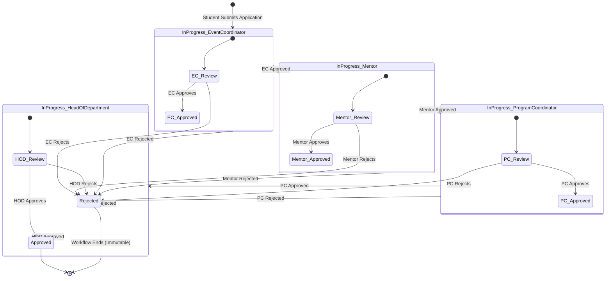
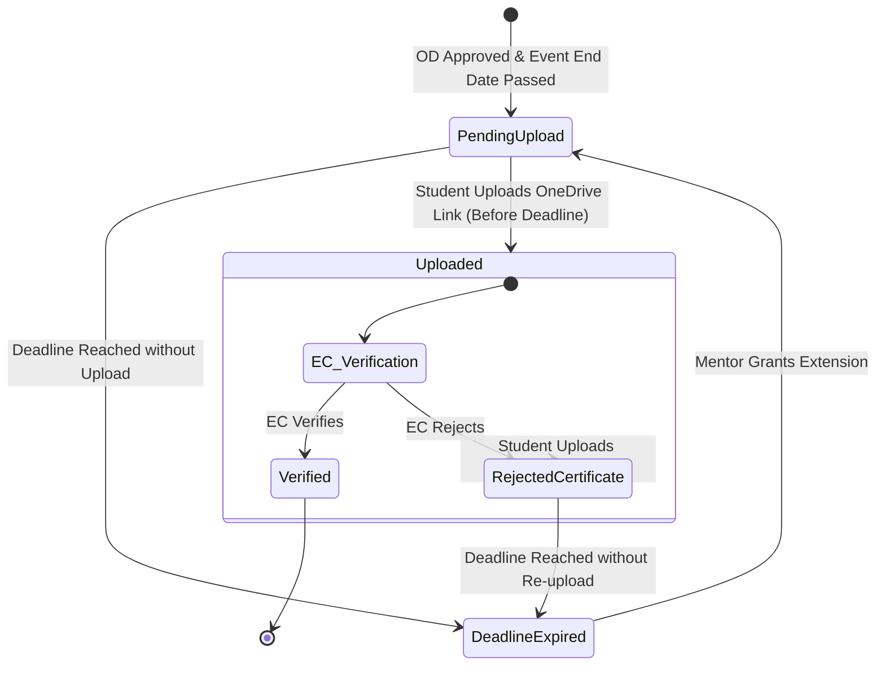

# Workflows & State Machines

This document outlines the step-by-step execution pipelines and state transitions for the two primary workflows in the MCET AI&DS OD Approval Web Application: the **On-Duty (OD) Approval Workflow** and the **Certificate Submission Workflow**.

---

## 1. On-Duty (OD) Approval Workflow

The OD approval process follows a strict linear sequence of validations. An application must proceed through all four faculty roles before achieving final approval.

### 1.1 State Machine Diagram

### 1.2 Step-by-Step Transition Log

1. **Submission:** Student submits an OD application. The application ID is generated, and the status changes to `In Progress: Event Coordinator`.
2. **First Review (Event Coordinator):**
   - **Approve:** The Event Coordinator marks their consent. Status transitions to `In Progress: Mentor`.
   - **Reject:** The Event Coordinator rejects the request (with optional comments). Status transitions to `Rejected`, halting the workflow.
3. **Second Review (Mentor):**
   - **Approve:** The Mentor (who is assigned to the student) verifies academic standing and marks consent. Status transitions to `In Progress: Program Coordinator`.
   - **Reject:** Status transitions to `Rejected`, halting the workflow.
4. **Third Review (Program Coordinator):**
   - **Approve:** The Program Coordinator conducts a departmental check. Status transitions to `In Progress: Head of Department`.
   - **Reject:** Status transitions to `Rejected`, halting the workflow.
5. **Final Sign-off (HOD):**
   - **Approve:** The HOD gives final departmental consent. Status transitions to `Approved`. The system registers the timestamp in `final_approved_at`.
   - **Reject:** Status transitions to `Rejected`, halting the workflow.

---

## 2. Certificate Submission Workflow

The certificate lifecycle is decoupled from the OD application. It begins automatically only after the OD application is fully approved **and** the event dates have concluded.

### 2.1 State Machine Diagram

### 2.2 Workflow Details

1. **Trigger:** The state transitions from inactive to `Pending Upload` as soon as the event `to_date` has elapsed for a fully `Approved` OD application.
2. **Deadline Calculation:**
   - The default submission deadline is set to `to_date + 7 days`.
   - If the current date exceeds the deadline and the status is still `Pending Upload`, the system updates the state to `Deadline Expired`.
3. **Extension Intervention:**
   - If a student cannot upload on time, their assigned Mentor can grant a one-time deadline extension.
   - The status is reset to `Pending Upload`, and the new deadline date is registered in the extensions ledger.
4. **Student Submission:**
   - The student uploads the certificate file to Microsoft OneDrive and links the folder/file URL in the application.
   - Status changes to `Uploaded`.
5. **Verification (Event Coordinator):**
   - The Event Coordinator reviews the document.
   - **Verify:** Status changes to `Verified`. The lifecycle terminates successfully.
   - **Reject:** The Event Coordinator provides comments detailing why the certificate was rejected (e.g., "Blurry upload" or "Incorrect name"). The status transitions to `Rejected`.
6. **Re-upload Cycle:**
   - The student is notified (via UI status changes) and can upload a replacement certificate, moving the state back to `Uploaded`.
